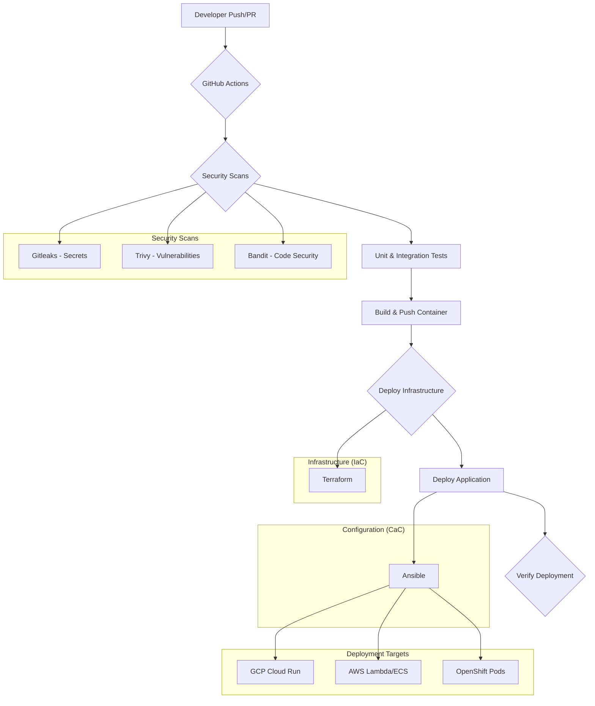

# CI/CD Pipeline and Security Strategy for Code Index MCP

**Author**: Tosin Akinsho
**Date**: Nov 10, 2025

## 1. Introduction

This document outlines the comprehensive CI/CD pipeline and security architecture designed and implemented for the **Code Index MCP** project. The primary objective is to establish a robust, secure, and automated framework for continuous integration and deployment across multiple cloud environments, with a priority on Google Cloud Platform (GCP), and additional support for Amazon Web Services (AWS) and Red Hat OpenShift.

The implemented solution provides automated workflows for building, testing, and deploying the application, while incorporating critical security measures at every stage of the pipeline. It also includes controlled, manual procedures for infrastructure deletion to prevent accidental data loss and resource removal.

## 2. Core CI/CD and Security Architecture

A detailed breakdown of the security architecture is available in the `cicd-security-architecture.md` document. The architecture is founded on the following key principles:

- **Least Privilege**: All automated processes and service accounts are granted only the minimum permissions necessary to perform their tasks.
- **Secrets Management**: Sensitive information such as API keys, tokens, and passwords are managed through secure, centralized secret stores (GitHub Secrets, GCP Secret Manager, AWS Secrets Manager, and OpenShift Sealed Secrets).
- **Infrastructure as Code (IaC)**: Terraform is used to define and manage cloud infrastructure, ensuring consistency, repeatability, and version control.
- **Configuration as Code**: Ansible is employed for application configuration and deployment orchestration, providing a clear and auditable setup process.
- **Automated Security Scanning**: The pipelines integrate multiple security tools (Gitleaks, Trivy, Bandit) to automatically scan for secrets, vulnerabilities, and code quality issues.
- **Controlled Deletion**: Manual approval steps and interactive scripts are implemented to safeguard against accidental deletion of production and staging environments.

### Architecture Diagram

## 3. GitHub Actions Workflows

Three primary GitHub Actions workflows have been implemented to handle deployments to GCP, AWS, and OpenShift. These workflows are located in the `.github/workflows/` directory.

### Key Workflow Files

| Workflow File | Description |
|---|---|
| `deploy-gcp.yml` | Handles the complete CI/CD process for Google Cloud Platform. It includes security scanning, testing, container image building, infrastructure deployment with Terraform, and application deployment with Ansible. |
| `delete-gcp.yml` | Provides a manual, approval-gated workflow to safely delete GCP resources for non-production environments. |
| `deploy-aws.yml` | Manages CI/CD for AWS, deploying to either Lambda or ECS based on user input. |
| `deploy-openshift.yml` | Orchestrates the build and deployment process for OpenShift using Helm and Ansible. |

### Common Workflow Stages

1.  **Security Scanning**: Automatically runs on every push and pull request to detect vulnerabilities and exposed secrets before they are introduced into the codebase.
2.  **Testing**: Executes the full suite of unit and integration tests to ensure code quality and correctness.
3.  **Build and Push**: Builds a new container image, tags it with the commit SHA, and pushes it to the appropriate container registry (GCP Artifact Registry, Amazon ECR, or OpenShift Internal Registry).
4.  **Deploy Infrastructure**: Uses Terraform to provision and manage the necessary cloud infrastructure, such as databases, VPCs, and IAM roles.
5.  **Deploy Application**: Uses Ansible to configure and deploy the application to the target environment (Cloud Run, ECS, or OpenShift).
6.  **Verification**: Performs health checks to ensure the deployment was successful and the service is responsive.

## 4. Deployment and Management Scripts

To facilitate both automated and manual management of the infrastructure, a combination of Ansible playbooks and shell scripts has been created.

### Ansible Playbooks

Ansible is used for application-level deployment and configuration. The key playbooks are:

- **`deploy.yml`**: The main playbook for deploying the Code Index MCP application. It configures the service, sets environment variables, and applies necessary settings.
- **`utilities.yml`**: A collection of management tasks, including:
    - `generate_api_key`: Creates a new API key for a user.
    - `verify_schema`: Checks if the database schema is correctly applied.
    - `teardown`: Deletes application-level resources (Cloud Run service, etc.).
    - `backup`/`restore`: Performs database backup and restore operations.

### Interactive Deletion Script

- **`delete-infrastructure.sh`**: A shell script located in `deployment/gcp/scripts/` that provides a safe, interactive command-line interface for deleting GCP infrastructure. It includes multiple confirmation steps and audit logging to prevent accidental deletion, especially for sensitive environments.

## 5. Tekton Pipeline for OpenShift

For teams utilizing OpenShift-native CI/CD, a complete Tekton pipeline has been implemented. This provides an alternative to GitHub Actions and runs entirely within the OpenShift cluster.

### Tekton Components

- **`pipeline.yaml`**: Defines the end-to-end CI/CD pipeline, including steps for cloning, scanning, testing, building, and deploying the application.
- **`triggers.yaml`**: Configures `EventListeners`, `TriggerBindings`, and `TriggerTemplates` to automatically start the pipeline in response to Git webhooks (e.g., on a `git push` to the main branch).
- **`tasks.yaml`**: Contains definitions for custom `Tasks` used in the pipeline, such as running Gitleaks, Trivy, and Pylint.

This Tekton setup enables a fully automated, in-cluster CI/CD experience that aligns with GitOps principles.

## 6. Setup and Usage Instructions

### Prerequisites

1.  **Cloud Provider CLI**: Ensure you have the `gcloud`, `aws`, and `oc` command-line tools installed and authenticated.
2.  **Terraform and Ansible**: Install Terraform (`>=1.5.0`) and Ansible (`>=2.14`).
3.  **GitHub Secrets**: Configure the required secrets in your GitHub repository settings. These include cloud provider credentials (via OIDC), project IDs, and other sensitive tokens.

    **Example GCP Secrets:**
    - `GCP_PROJECT_ID`: Your Google Cloud project ID.
    - `GCP_WORKLOAD_IDENTITY_PROVIDER`: The full path of your Workload Identity Provider.
    - `GCP_SERVICE_ACCOUNT`: The email of the service account for GitHub Actions.

### Triggering a Deployment

- **Automated**: Push a commit to the `main` or `develop` branch.
- **Manual**: Navigate to the "Actions" tab in your GitHub repository, select the desired workflow (e.g., "Deploy to Google Cloud Platform"), and click "Run workflow". You can specify the target environment (dev, staging) here.

### Manual Deletion Process (GCP)

1.  **Via GitHub Actions**:
    - Go to the "Actions" tab and select the "Delete GCP Infrastructure" workflow.
    - Click "Run workflow".
    - Specify the environment, confirm by typing `DELETE`, and provide a reason.
    - The workflow requires manual approval from a designated reviewer before proceeding.

2.  **Via Interactive Script**:
    - Navigate to the `deployment/gcp/scripts/` directory.
    - Run the script: `./delete-infrastructure.sh <environment>` (e.g., `./delete-infrastructure.sh dev`).
    - Follow the interactive prompts, which include multiple confirmations to prevent accidents.

## 7. Conclusion

This implementation provides the Code Index MCP project with a modern, secure, and flexible CI/CD framework. By leveraging industry-standard tools like GitHub Actions, Terraform, Ansible, and Tekton, the project is now equipped for automated, repeatable, and safe deployments across multiple cloud platforms.

The architecture emphasizes security and control, ensuring that while deployments are automated, critical operations like infrastructure deletion are subject to rigorous manual checks and approvals. This balance empowers developers to move quickly while protecting the stability and integrity of the production environment.

## 8. Attachments

- `cicd-security-architecture.md`: Detailed security design document.
- `.github/workflows/`: Directory containing all GitHub Actions workflows.
- `deployment/`: Directory containing all Terraform, Ansible, Helm, and Tekton configurations.
