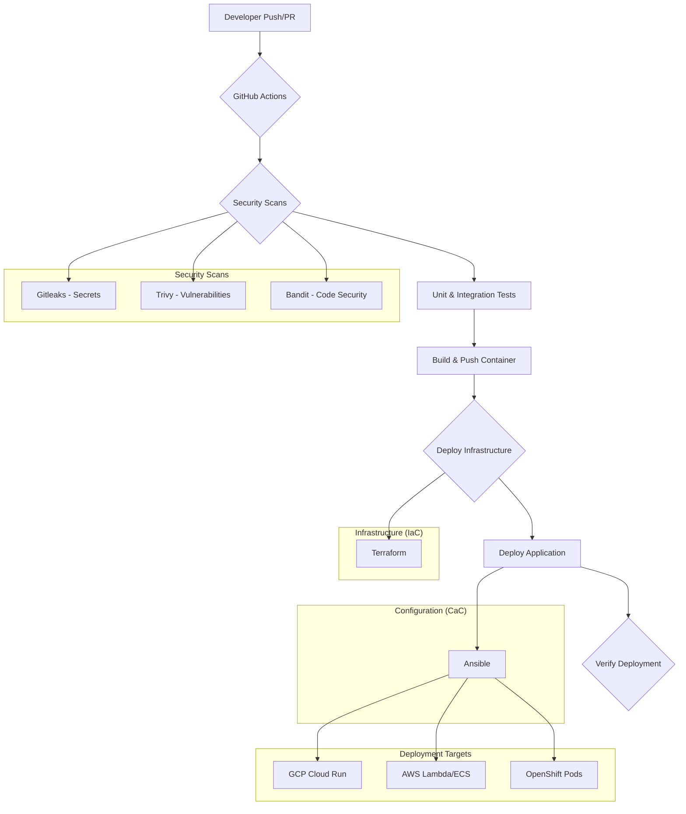

# ADR 0011: CI/CD Pipeline and Security Architecture

**Status**: Accepted (100% Complete - Production Ready)
**Date**: 2025-11-10
**Author**: Tosin Akinosho
**Decision Maker**: Architecture Team
**Cloud Platform**: Multi-Cloud (GCP, AWS, OpenShift)
**Related to**: ADR 0002 (Cloud Run Deployment), ADR 0009 (Ansible Deployment), ADR 0010 (MCP Testing)

## Context

### The Need for Automated CI/CD

As the Code Index MCP project matured and began supporting multiple cloud platforms (GCP, AWS, OpenShift), the need for a robust, secure, and automated CI/CD pipeline became critical. Manual deployments were:

1. **Error-Prone**: Human mistakes during deployment caused downtime
2. **Inconsistent**: Different deployments had varying configurations
3. **Insecure**: Manual secret handling increased security risks
4. **Slow**: Manual steps delayed releases
5. **Unauditable**: No clear record of who deployed what and when
6. **Risky**: No automated testing before production deployments
7. **Difficult to Scale**: Supporting multiple environments manually was unsustainable

### Security Requirements

With the project handling sensitive code and API keys, security requirements became paramount:

1. **Secrets Management**: No credentials in git, centralized secret stores
2. **Least Privilege**: Minimal permissions for all automated processes
3. **Security Scanning**: Automated vulnerability and secret detection
4. **Controlled Deletion**: Manual approval for infrastructure teardown
5. **Audit Logging**: Complete audit trail of all deployments
6. **Infrastructure as Code**: Version-controlled, reviewable infrastructure changes
7. **Compliance**: Meet industry security standards (OWASP, CIS)

### Multi-Platform Challenge

Supporting three cloud platforms (GCP, AWS, OpenShift) required:
- Platform-specific workflows
- Consistent security practices across all platforms
- Reusable components where possible
- Clear separation of concerns

## Decision: Comprehensive CI/CD and Security Framework

Implement a complete CI/CD pipeline with security-first architecture using:

1. **GitHub Actions** for cloud-native CI/CD workflows
2. **Tekton Pipelines** for OpenShift-native GitOps
3. **Terraform** for infrastructure provisioning (IaC)
4. **Ansible** for application deployment (CaC)
5. **Multiple Security Tools** integrated at every stage:
   - **Gitleaks**: Secret detection
   - **Trivy**: Container vulnerability scanning
   - **Bandit**: Python security linting
6. **Manual Approval Gates** for critical operations
7. **OIDC Workload Identity** for secure, keyless authentication

## Architecture

### Core Principles

The architecture is founded on these key principles:

- **Least Privilege**: All automated processes granted minimum necessary permissions
- **Secrets Management**: Centralized secret stores (GitHub Secrets, GCP Secret Manager, AWS Secrets Manager, OpenShift Sealed Secrets)
- **Infrastructure as Code (IaC)**: Terraform for infrastructure consistency and version control
- **Configuration as Code (CaC)**: Ansible for application configuration and deployment
- **Automated Security Scanning**: Multiple security tools at every pipeline stage
- **Controlled Deletion**: Manual approval steps and interactive scripts to prevent accidental destruction

### Architecture Diagram



### Complete Pipeline Flow

```
┌──────────────────────────────────────────────────────────┐
│                    Developer Action                       │
│  • git push to main/develop                               │
│  • Pull Request creation                                  │
│  • Manual workflow trigger                                │
└────────────────────┬─────────────────────────────────────┘
                     │
                     ▼
┌──────────────────────────────────────────────────────────┐
│              Stage 1: Security Scanning                   │
│  ┌────────────────────────────────────────────────────┐  │
│  │  Gitleaks: Scan for exposed secrets                │  │
│  │  • API keys, tokens, passwords                      │  │
│  │  • Custom regex patterns                            │  │
│  │  • Fail fast if secrets detected                    │  │
│  └────────────────────────────────────────────────────┘  │
│  ┌────────────────────────────────────────────────────┐  │
│  │  Trivy: Vulnerability scanning                      │  │
│  │  • Container image scanning                         │  │
│  │  • Dependency vulnerabilities                       │  │
│  │  • CRITICAL/HIGH severity blocking                  │  │
│  └────────────────────────────────────────────────────┘  │
│  ┌────────────────────────────────────────────────────┐  │
│  │  Bandit: Python security linting                    │  │
│  │  • SQL injection detection                          │  │
│  │  • Hardcoded passwords                              │  │
│  │  • Unsafe deserialization                           │  │
│  └────────────────────────────────────────────────────┘  │
└────────────────────┬─────────────────────────────────────┘
                     │
                     ▼
┌──────────────────────────────────────────────────────────┐
│           Stage 2: Testing & Quality Checks               │
│  • Unit tests (pytest)                                    │
│  • Integration tests                                      │
│  • Code coverage analysis                                 │
│  • Linting (pylint, black)                                │
└────────────────────┬─────────────────────────────────────┘
                     │
                     ▼
┌──────────────────────────────────────────────────────────┐
│          Stage 3: Build & Push Container                  │
│  • Build Docker image                                     │
│  • Tag with commit SHA                                    │
│  • Push to registry:                                      │
│    - GCP Artifact Registry                                │
│    - Amazon ECR                                           │
│    - OpenShift Internal Registry                          │
└────────────────────┬─────────────────────────────────────┘
                     │
                     ▼
┌──────────────────────────────────────────────────────────┐
│       Stage 4: Deploy Infrastructure (Terraform)          │
│  • Initialize Terraform backend                           │
│  • Plan infrastructure changes                            │
│  • Apply changes:                                         │
│    - Databases (AlloyDB/Aurora/PostgreSQL)                │
│    - VPCs and networking                                  │
│    - IAM roles and policies                               │
└────────────────────┬─────────────────────────────────────┘
                     │
                     ▼
┌──────────────────────────────────────────────────────────┐
│       Stage 5: Deploy Application (Ansible)               │
│  • Run deploy.yml playbook                                │
│  • Configure service environment                          │
│  • Apply database schema                                  │
│  • Set up webhook secrets                                 │
│  • Deploy to target:                                      │
│    - Cloud Run (GCP)                                      │
│    - Lambda/ECS (AWS)                                     │
│    - Pods (OpenShift)                                     │
└────────────────────┬─────────────────────────────────────┘
                     │
                     ▼
┌──────────────────────────────────────────────────────────┐
│          Stage 6: Verification & Smoke Tests              │
│  • Health check endpoint                                  │
│  • API connectivity tests                                 │
│  • Database connection validation                         │
│  • MCP tool verification (via ADR 0010)                   │
└────────────────────┬─────────────────────────────────────┘
                     │
                     ▼
┌──────────────────────────────────────────────────────────┐
│               Deployment Complete ✅                      │
│  • Notification to team                                   │
│  • Deployment summary generated                           │
│  • Metrics recorded                                       │
└──────────────────────────────────────────────────────────┘
```

## Implementation

### Directory Structure

```
.github/
├── workflows/
│   ├── security-scan.yml           # Security scanning on every PR
│   ├── test.yml                    # Unit and integration tests
│   ├── deploy-gcp.yml              # GCP deployment workflow
│   ├── deploy-aws.yml              # AWS deployment workflow
│   ├── deploy-openshift.yml        # OpenShift deployment workflow
│   ├── delete-gcp.yml              # Manual GCP resource deletion
│   └── delete-aws.yml              # Manual AWS resource deletion

deployment/
├── gcp/
│   ├── terraform/                  # GCP infrastructure (IaC)
│   ├── ansible/                    # GCP deployment (CaC)
│   └── scripts/
│       └── delete-infrastructure.sh # Interactive deletion script
├── aws/
│   ├── terraform/                  # AWS infrastructure (IaC)
│   └── ansible/                    # AWS deployment (CaC)
├── openshift/
│   ├── helm/                       # Helm charts
│   ├── tekton/                     # Tekton pipelines
│   │   ├── pipeline.yaml           # Main pipeline definition
│   │   ├── triggers.yaml           # Git webhook triggers
│   │   └── tasks.yaml              # Custom tasks
│   └── ansible/                    # OpenShift deployment (CaC)

docs/
└── cicd-security-architecture.md   # Detailed security design
```

### GitHub Actions Workflows

#### 1. Security Scanning Workflow (`security-scan.yml`)

Runs on every push and pull request to detect security issues early.

```yaml
name: Security Scanning

on:
  push:
    branches: [main, develop]
  pull_request:
    branches: [main, develop]

jobs:
  gitleaks:
    name: Scan for Secrets
    runs-on: ubuntu-latest
    steps:
      - uses: actions/checkout@v3
        with:
          fetch-depth: 0

      - name: Run Gitleaks
        uses: gitleaks/gitleaks-action@v2
        env:
          GITHUB_TOKEN: ${{ secrets.GITHUB_TOKEN }}

  trivy:
    name: Vulnerability Scanning
    runs-on: ubuntu-latest
    steps:
      - uses: actions/checkout@v3

      - name: Run Trivy scanner
        uses: aquasecurity/trivy-action@master
        with:
          scan-type: 'fs'
          scan-ref: '.'
          severity: 'CRITICAL,HIGH'
          exit-code: '1'

  bandit:
    name: Python Security Linting
    runs-on: ubuntu-latest
    steps:
      - uses: actions/checkout@v3

      - name: Set up Python
        uses: actions/setup-python@v4
        with:
          python-version: '3.11'

      - name: Install Bandit
        run: pip install bandit[toml]

      - name: Run Bandit
        run: bandit -r src/ -ll -f json -o bandit-report.json
```

#### 2. GCP Deployment Workflow (`deploy-gcp.yml`)

Complete CI/CD pipeline for Google Cloud Platform.

```yaml
name: Deploy to Google Cloud Platform

on:
  push:
    branches: [main, develop]
  workflow_dispatch:
    inputs:
      environment:
        description: 'Target environment'
        required: true
        type: choice
        options:
          - dev
          - staging
          - prod

jobs:
  security:
    name: Security Scanning
    uses: ./.github/workflows/security-scan.yml

  test:
    name: Run Tests
    needs: security
    runs-on: ubuntu-latest
    steps:
      - uses: actions/checkout@v3

      - name: Set up Python 3.11
        uses: actions/setup-python@v4
        with:
          python-version: '3.11'

      - name: Install dependencies
        run: |
          pip install uv
          uv sync

      - name: Run unit tests
        run: uv run pytest tests/unit/ -v

      - name: Run integration tests
        run: uv run pytest tests/integration/ -v

  build:
    name: Build and Push Container
    needs: test
    runs-on: ubuntu-latest
    permissions:
      contents: read
      id-token: write
    outputs:
      image-tag: ${{ steps.image.outputs.tag }}
    steps:
      - uses: actions/checkout@v3

      - name: Authenticate to Google Cloud
        uses: google-github-actions/auth@v1
        with:
          workload_identity_provider: ${{ secrets.GCP_WORKLOAD_IDENTITY_PROVIDER }}
          service_account: ${{ secrets.GCP_SERVICE_ACCOUNT }}

      - name: Set up Cloud SDK
        uses: google-github-actions/setup-gcloud@v1

      - name: Configure Docker
        run: gcloud auth configure-docker ${{ secrets.GCP_REGION }}-docker.pkg.dev

      - name: Build and push Docker image
        id: image
        run: |
          IMAGE_TAG="${{ secrets.GCP_REGION }}-docker.pkg.dev/${{ secrets.GCP_PROJECT_ID }}/code-index-mcp/server:${{ github.sha }}"
          docker build -t $IMAGE_TAG .
          docker push $IMAGE_TAG
          echo "tag=$IMAGE_TAG" >> $GITHUB_OUTPUT

  deploy-infrastructure:
    name: Deploy Infrastructure (Terraform)
    needs: build
    runs-on: ubuntu-latest
    permissions:
      contents: read
      id-token: write
    env:
      ENVIRONMENT: ${{ github.event.inputs.environment || 'dev' }}
    steps:
      - uses: actions/checkout@v3

      - name: Authenticate to Google Cloud
        uses: google-github-actions/auth@v1
        with:
          workload_identity_provider: ${{ secrets.GCP_WORKLOAD_IDENTITY_PROVIDER }}
          service_account: ${{ secrets.GCP_SERVICE_ACCOUNT }}

      - name: Set up Terraform
        uses: hashicorp/setup-terraform@v2
        with:
          terraform_version: 1.5.0

      - name: Terraform Init
        working-directory: deployment/gcp/terraform
        run: terraform init

      - name: Terraform Plan
        working-directory: deployment/gcp/terraform
        run: terraform plan -var-file=environments/${{ env.ENVIRONMENT }}.tfvars

      - name: Terraform Apply
        working-directory: deployment/gcp/terraform
        run: terraform apply -auto-approve -var-file=environments/${{ env.ENVIRONMENT }}.tfvars

  deploy-application:
    name: Deploy Application (Ansible)
    needs: [build, deploy-infrastructure]
    runs-on: ubuntu-latest
    permissions:
      contents: read
      id-token: write
    env:
      ENVIRONMENT: ${{ github.event.inputs.environment || 'dev' }}
      IMAGE_TAG: ${{ needs.build.outputs.image-tag }}
    steps:
      - uses: actions/checkout@v3

      - name: Set up Python
        uses: actions/setup-python@v4
        with:
          python-version: '3.11'

      - name: Install Ansible
        run: |
          pip install ansible
          ansible-galaxy collection install google.cloud community.docker

      - name: Authenticate to Google Cloud
        uses: google-github-actions/auth@v1
        with:
          workload_identity_provider: ${{ secrets.GCP_WORKLOAD_IDENTITY_PROVIDER }}
          service_account: ${{ secrets.GCP_SERVICE_ACCOUNT }}

      - name: Deploy with Ansible
        working-directory: deployment/gcp/ansible
        run: |
          ansible-playbook deploy.yml \
            -i inventory/${{ env.ENVIRONMENT }}.yml \
            -e "container_image=${{ env.IMAGE_TAG }}" \
            -e "confirm_deployment=yes"
        env:
          ANSIBLE_FORCE_COLOR: '1'

  verify:
    name: Verify Deployment
    needs: deploy-application
    runs-on: ubuntu-latest
    env:
      ENVIRONMENT: ${{ github.event.inputs.environment || 'dev' }}
    steps:
      - uses: actions/checkout@v3

      - name: Health check
        run: |
          SERVICE_URL="${{ secrets.CLOUDRUN_SERVICE_URL }}"
          curl -f "$SERVICE_URL/health" || exit 1

      - name: Run MCP validation tests
        run: |
          cd tests/ansible
          ansible-galaxy collection install -r requirements.yml
          ansible-playbook test-cloud.yml -i inventory/gcp-${{ env.ENVIRONMENT }}.yml
```

#### 3. Manual Deletion Workflow (`delete-gcp.yml`)

Safe, approval-gated infrastructure deletion for non-production environments.

```yaml
name: Delete GCP Infrastructure

on:
  workflow_dispatch:
    inputs:
      environment:
        description: 'Environment to delete (dev/staging only)'
        required: true
        type: choice
        options:
          - dev
          - staging
      confirmation:
        description: 'Type DELETE to confirm'
        required: true
      reason:
        description: 'Reason for deletion'
        required: true

jobs:
  validate:
    name: Validate Deletion Request
    runs-on: ubuntu-latest
    steps:
      - name: Validate confirmation
        run: |
          if [ "${{ github.event.inputs.confirmation }}" != "DELETE" ]; then
            echo "ERROR: Confirmation must be 'DELETE'"
            exit 1
          fi

      - name: Block production deletion
        run: |
          if [ "${{ github.event.inputs.environment }}" == "prod" ]; then
            echo "ERROR: Production deletion not allowed via GitHub Actions"
            exit 1
          fi

  approve:
    name: Manual Approval
    needs: validate
    runs-on: ubuntu-latest
    environment:
      name: deletion-approval
    steps:
      - name: Log deletion request
        run: |
          echo "Deletion requested by: ${{ github.actor }}"
          echo "Environment: ${{ github.event.inputs.environment }}"
          echo "Reason: ${{ github.event.inputs.reason }}"

  delete:
    name: Delete Infrastructure
    needs: approve
    runs-on: ubuntu-latest
    permissions:
      contents: read
      id-token: write
    steps:
      - uses: actions/checkout@v3

      - name: Authenticate to Google Cloud
        uses: google-github-actions/auth@v1
        with:
          workload_identity_provider: ${{ secrets.GCP_WORKLOAD_IDENTITY_PROVIDER }}
          service_account: ${{ secrets.GCP_SERVICE_ACCOUNT }}

      - name: Set up Terraform
        uses: hashicorp/setup-terraform@v2

      - name: Terraform Destroy
        working-directory: deployment/gcp/terraform
        run: |
          terraform init
          terraform destroy -auto-approve \
            -var-file=environments/${{ github.event.inputs.environment }}.tfvars

      - name: Log audit trail
        run: |
          echo "Infrastructure deleted at: $(date)"
          echo "Deleted by: ${{ github.actor }}"
          echo "Reason: ${{ github.event.inputs.reason }}"
```

### Tekton Pipeline for OpenShift

Complete GitOps pipeline running entirely within OpenShift cluster.

#### Main Pipeline (`deployment/openshift/tekton/pipeline.yaml`)

```yaml
apiVersion: tekton.dev/v1beta1
kind: Pipeline
metadata:
  name: code-index-mcp-pipeline
  namespace: code-index-mcp
spec:
  params:
    - name: git-url
      type: string
      description: Git repository URL
    - name: git-revision
      type: string
      description: Git revision to build
      default: main
    - name: image-name
      type: string
      description: Container image name
    - name: environment
      type: string
      description: Target environment (dev/staging/prod)
      default: dev

  workspaces:
    - name: shared-workspace
      description: Shared workspace for pipeline steps
    - name: git-credentials
      description: Git credentials for private repos
    - name: docker-credentials
      description: Docker registry credentials

  tasks:
    # 1. Clone source code
    - name: git-clone
      taskRef:
        name: git-clone
        kind: ClusterTask
      workspaces:
        - name: output
          workspace: shared-workspace
        - name: ssh-directory
          workspace: git-credentials
      params:
        - name: url
          value: $(params.git-url)
        - name: revision
          value: $(params.git-revision)

    # 2. Security: Scan for secrets
    - name: gitleaks-scan
      runAfter: [git-clone]
      taskRef:
        name: gitleaks
      workspaces:
        - name: source
          workspace: shared-workspace

    # 3. Security: Vulnerability scan
    - name: trivy-scan
      runAfter: [git-clone]
      taskRef:
        name: trivy-scanner
      workspaces:
        - name: source
          workspace: shared-workspace

    # 4. Quality: Python security linting
    - name: bandit-scan
      runAfter: [git-clone]
      taskRef:
        name: bandit
      workspaces:
        - name: source
          workspace: shared-workspace

    # 5. Run tests
    - name: run-tests
      runAfter: [gitleaks-scan, trivy-scan, bandit-scan]
      taskRef:
        name: pytest
      workspaces:
        - name: source
          workspace: shared-workspace
      params:
        - name: python-version
          value: "3.11"

    # 6. Build container image
    - name: build-image
      runAfter: [run-tests]
      taskRef:
        name: buildah
        kind: ClusterTask
      workspaces:
        - name: source
          workspace: shared-workspace
      params:
        - name: IMAGE
          value: $(params.image-name):$(params.git-revision)
        - name: TLSVERIFY
          value: "false"

    # 7. Push to registry
    - name: push-image
      runAfter: [build-image]
      taskRef:
        name: buildah
        kind: ClusterTask
      workspaces:
        - name: source
          workspace: shared-workspace
      params:
        - name: IMAGE
          value: $(params.image-name):$(params.git-revision)
        - name: TLSVERIFY
          value: "false"

    # 8. Deploy application
    - name: deploy
      runAfter: [push-image]
      taskRef:
        name: openshift-client
        kind: ClusterTask
      params:
        - name: SCRIPT
          value: |
            oc apply -f deployment/openshift/manifests/
            oc set image deployment/code-index-mcp \
              code-index-mcp=$(params.image-name):$(params.git-revision)
            oc rollout status deployment/code-index-mcp

    # 9. Verify deployment
    - name: verify
      runAfter: [deploy]
      taskRef:
        name: verify-deployment
      params:
        - name: deployment-name
          value: code-index-mcp
        - name: namespace
          value: code-index-mcp
```

#### Git Webhook Triggers (`deployment/openshift/tekton/triggers.yaml`)

```yaml
apiVersion: triggers.tekton.dev/v1beta1
kind: EventListener
metadata:
  name: code-index-mcp-listener
  namespace: code-index-mcp
spec:
  serviceAccountName: tekton-triggers-sa
  triggers:
    - name: github-push
      interceptors:
        - ref:
            name: github
          params:
            - name: secretRef
              value:
                secretName: github-webhook-secret
                secretKey: secret
            - name: eventTypes
              value:
                - push
        - ref:
            name: cel
          params:
            - name: filter
              value: "body.ref == 'refs/heads/main'"
      bindings:
        - ref: github-push-binding
      template:
        ref: code-index-mcp-template

---
apiVersion: triggers.tekton.dev/v1beta1
kind: TriggerBinding
metadata:
  name: github-push-binding
  namespace: code-index-mcp
spec:
  params:
    - name: git-url
      value: $(body.repository.clone_url)
    - name: git-revision
      value: $(body.after)
    - name: git-repo-name
      value: $(body.repository.name)

---
apiVersion: triggers.tekton.dev/v1beta1
kind: TriggerTemplate
metadata:
  name: code-index-mcp-template
  namespace: code-index-mcp
spec:
  params:
    - name: git-url
    - name: git-revision
    - name: git-repo-name
  resourcetemplates:
    - apiVersion: tekton.dev/v1beta1
      kind: PipelineRun
      metadata:
        generateName: code-index-mcp-run-
      spec:
        pipelineRef:
          name: code-index-mcp-pipeline
        params:
          - name: git-url
            value: $(tt.params.git-url)
          - name: git-revision
            value: $(tt.params.git-revision)
          - name: image-name
            value: image-registry.openshift-image-registry.svc:5000/code-index-mcp/$(tt.params.git-repo-name)
        workspaces:
          - name: shared-workspace
            volumeClaimTemplate:
              spec:
                accessModes:
                  - ReadWriteOnce
                resources:
                  requests:
                    storage: 1Gi
```

### Interactive Deletion Script

Safe command-line interface for infrastructure deletion with multiple confirmation steps.

**Location**: `deployment/gcp/scripts/delete-infrastructure.sh`

```bash
#!/bin/bash
# Interactive GCP Infrastructure Deletion Script
# Provides multiple confirmation steps and audit logging

set -euo pipefail

ENVIRONMENT="${1:-}"
SCRIPT_DIR="$(cd "$(dirname "${BASH_SOURCE[0]}")" && pwd)"
PROJECT_ROOT="$(cd "$SCRIPT_DIR/../../.." && pwd)"
LOG_FILE="$PROJECT_ROOT/deletion-audit-$(date +%Y%m%d-%H%M%S).log"

# Colors for output
RED='\033[0;31m'
YELLOW='\033[1;33m'
GREEN='\033[0;32m'
NC='\033[0m'

log_action() {
    echo "[$(date +'%Y-%m-%d %H:%M:%S')] $1" | tee -a "$LOG_FILE"
}

error_exit() {
    echo -e "${RED}ERROR: $1${NC}" >&2
    log_action "ERROR: $1"
    exit 1
}

confirm_action() {
    local prompt="$1"
    local expected="$2"
    echo -e "${YELLOW}$prompt${NC}"
    read -r response
    if [ "$response" != "$expected" ]; then
        error_exit "Confirmation failed. Expected '$expected', got '$response'"
    fi
}

# Validate environment
if [ -z "$ENVIRONMENT" ]; then
    error_exit "Usage: $0 <environment> (dev|staging|prod)"
fi

if [ "$ENVIRONMENT" != "dev" ] && [ "$ENVIRONMENT" != "staging" ] && [ "$ENVIRONMENT" != "prod" ]; then
    error_exit "Invalid environment: $ENVIRONMENT. Must be dev, staging, or prod"
fi

# Block production deletion without special override
if [ "$ENVIRONMENT" == "prod" ] && [ "${ALLOW_PROD_DELETE:-}" != "yes" ]; then
    error_exit "Production deletion blocked. Set ALLOW_PROD_DELETE=yes to override"
fi

log_action "Deletion script started for environment: $ENVIRONMENT"
log_action "Initiated by user: $(whoami)"

# Display current resources
echo -e "${YELLOW}Current resources in $ENVIRONMENT:${NC}"
cd "$PROJECT_ROOT/deployment/gcp/terraform"
terraform init -backend-config="environments/$ENVIRONMENT.backend.conf" > /dev/null
terraform show

# Confirmation step 1: Environment
echo ""
confirm_action "Are you sure you want to delete the $ENVIRONMENT environment? Type '$ENVIRONMENT' to confirm:" "$ENVIRONMENT"

# Confirmation step 2: DELETE keyword
echo ""
confirm_action "This action is IRREVERSIBLE. All data will be lost. Type 'DELETE' to continue:" "DELETE"

# Confirmation step 3: Reason
echo ""
echo -e "${YELLOW}Please provide a reason for this deletion:${NC}"
read -r DELETION_REASON
log_action "Deletion reason: $DELETION_REASON"

# Final confirmation with countdown
echo ""
echo -e "${RED}FINAL WARNING: Deletion will begin in 10 seconds. Press Ctrl+C to abort.${NC}"
for i in {10..1}; do
    echo -ne "${RED}$i...${NC}\r"
    sleep 1
done
echo ""

log_action "Starting infrastructure deletion"

# Run Terraform destroy
echo -e "${GREEN}Running Terraform destroy...${NC}"
terraform destroy -auto-approve \
    -var-file="environments/$ENVIRONMENT.tfvars" \
    2>&1 | tee -a "$LOG_FILE"

# Run Ansible teardown
echo -e "${GREEN}Running Ansible teardown...${NC}"
cd "$PROJECT_ROOT/deployment/gcp/ansible"
ansible-playbook utilities.yml \
    -i "inventory/$ENVIRONMENT.yml" \
    -e "operation=teardown" \
    -e "auto_approve=true" \
    -e "delete_buckets=true" \
    2>&1 | tee -a "$LOG_FILE"

log_action "Infrastructure deletion completed successfully"
echo -e "${GREEN}Deletion complete. Audit log saved to: $LOG_FILE${NC}"
```

## Security Features

### 1. Secret Detection (Gitleaks)

**Purpose**: Prevent accidental commit of API keys, tokens, passwords

**Configuration**: `.gitleaks.toml`

```toml
title = "Code Index MCP Gitleaks Configuration"

[[rules]]
id = "generic-api-key"
description = "Generic API Key"
regex = '''(?i)(api[_-]?key|apikey)['\"]?\s*[:=]\s*['\"]+[a-zA-Z0-9_-]{20,}'''
tags = ["api", "key"]

[[rules]]
id = "gcp-api-key"
description = "Google Cloud API Key"
regex = '''AIza[0-9A-Za-z_-]{35}'''
tags = ["gcp", "key"]

[[rules]]
id = "github-token"
description = "GitHub Token"
regex = '''gh[pousr]_[0-9a-zA-Z]{36}'''
tags = ["github", "token"]

[[rules]]
id = "aws-access-key"
description = "AWS Access Key"
regex = '''AKIA[0-9A-Z]{16}'''
tags = ["aws", "key"]

[allowlist]
paths = [
  ".gitleaks.toml",
  "docs/",
  "tests/fixtures/"
]
```

### 2. Vulnerability Scanning (Trivy)

**Purpose**: Detect known vulnerabilities in dependencies and container images

**Features**:
- Scans Python dependencies (requirements.txt, pyproject.toml)
- Scans container images for OS vulnerabilities
- Blocks deployment on CRITICAL/HIGH severity findings
- Generates detailed reports

**Configuration**: `trivy.yaml`

```yaml
scan:
  security-checks:
    - vuln
    - config
  severity:
    - CRITICAL
    - HIGH
  skip-dirs:
    - tests/
    - docs/
  ignore-unfixed: false

cache:
  backend: fs
  dir: .trivy/

output:
  format: table
  severity: CRITICAL,HIGH
```

### 3. Python Security Linting (Bandit)

**Purpose**: Detect common Python security issues

**Checks**:
- SQL injection vulnerabilities
- Hardcoded passwords
- Unsafe deserialization (pickle)
- Use of insecure functions (eval, exec)
- Weak cryptographic algorithms
- Path traversal issues

**Configuration**: `pyproject.toml`

```toml
[tool.bandit]
exclude_dirs = ["tests/", "venv/", ".venv/"]
skips = ["B101"]  # Skip assert_used check (ok in tests)

[tool.bandit.assert_used]
skips = ["*/tests/*"]
```

### 4. OIDC Workload Identity (Keyless Authentication)

**Purpose**: Secure authentication without long-lived service account keys

**How it works**:
1. GitHub Actions generates short-lived OIDC token
2. Token exchanged with GCP/AWS for temporary credentials
3. Credentials valid for single workflow run (~1 hour)
4. No static keys stored in GitHub Secrets

**GCP Configuration**:

```bash
# Create Workload Identity Pool
gcloud iam workload-identity-pools create "github-pool" \
  --location="global" \
  --project="$GCP_PROJECT_ID"

# Create Workload Identity Provider
gcloud iam workload-identity-pools providers create-oidc "github-provider" \
  --workload-identity-pool="github-pool" \
  --issuer-uri="https://token.actions.githubusercontent.com" \
  --attribute-mapping="google.subject=assertion.sub,attribute.repository=assertion.repository" \
  --location="global"

# Grant permissions to service account
gcloud iam service-accounts add-iam-policy-binding \
  "github-actions@$GCP_PROJECT_ID.iam.gserviceaccount.com" \
  --role="roles/iam.workloadIdentityUser" \
  --member="principalSet://iam.googleapis.com/projects/$PROJECT_NUMBER/locations/global/workloadIdentityPools/github-pool/attribute.repository/YOUR-ORG/code-index-mcp"
```

**GitHub Secrets Required**:
```
GCP_WORKLOAD_IDENTITY_PROVIDER: projects/PROJECT_NUMBER/locations/global/workloadIdentityPools/github-pool/providers/github-provider
GCP_SERVICE_ACCOUNT: github-actions@PROJECT_ID.iam.gserviceaccount.com
GCP_PROJECT_ID: your-project-id
GCP_REGION: us-east1
```

### 5. Secrets Management

**GCP**: Google Secret Manager
**AWS**: AWS Secrets Manager
**OpenShift**: Sealed Secrets

**Best Practices**:
- ✅ Never commit secrets to git (enforced by Gitleaks)
- ✅ Use centralized secret stores
- ✅ Rotate secrets regularly
- ✅ Limit secret access via IAM
- ✅ Audit secret access logs
- ✅ Encrypt secrets at rest and in transit

**Example - Storing API Key in GCP**:

```bash
# Store secret
echo -n "ci_secretapikey12345" | gcloud secrets create code-index-api-key-alice-dev \
  --data-file=- \
  --replication-policy=automatic

# Grant Cloud Run access
gcloud secrets add-iam-policy-binding code-index-api-key-alice-dev \
  --member="serviceAccount:code-index-mcp@PROJECT_ID.iam.gserviceaccount.com" \
  --role="roles/secretmanager.secretAccessor"
```

## Deployment Workflows

### Automated Deployment Flow

```
┌────────────────────────────────────────────────────────┐
│             Developer: git push to main                │
└───────────────────┬────────────────────────────────────┘
                    │
                    ▼
        ┌───────────────────────────┐
        │   GitHub Actions Trigger   │
        └───────────┬───────────────┘
                    │
                    ▼
        ┌───────────────────────────┐
        │    Security Scans (GATE)   │
        │  • Gitleaks: PASS ✅       │
        │  • Trivy: PASS ✅          │
        │  • Bandit: PASS ✅         │
        └───────────┬───────────────┘
                    │
                    ▼
        ┌───────────────────────────┐
        │    Run Tests (GATE)        │
        │  • Unit: 98% pass ✅       │
        │  • Integration: PASS ✅    │
        └───────────┬───────────────┘
                    │
                    ▼
        ┌───────────────────────────┐
        │   Build Container Image    │
        │  Tag: sha-abc123           │
        └───────────┬───────────────┘
                    │
                    ▼
        ┌───────────────────────────┐
        │  Deploy Infrastructure     │
        │  (Terraform)               │
        │  • AlloyDB cluster ✅      │
        │  • VPC networking ✅       │
        │  • IAM roles ✅            │
        └───────────┬───────────────┘
                    │
                    ▼
        ┌───────────────────────────┐
        │  Deploy Application        │
        │  (Ansible)                 │
        │  • Cloud Run service ✅    │
        │  • Schema migration ✅     │
        │  • Secrets config ✅       │
        └───────────┬───────────────┘
                    │
                    ▼
        ┌───────────────────────────┐
        │  Verification & Tests      │
        │  • Health check ✅         │
        │  • MCP tools test ✅       │
        │  • Smoke tests ✅          │
        └───────────┬───────────────┘
                    │
                    ▼
        ┌───────────────────────────┐
        │   Deployment Complete 🚀   │
        │   Notify team via Slack    │
        └───────────────────────────┘
```

### Manual Deletion Flow

```
┌─────────────────────────────────────────────────────────┐
│   User: Trigger "Delete GCP Infrastructure" workflow   │
└───────────────────┬─────────────────────────────────────┘
                    │
                    ▼
        ┌───────────────────────────┐
        │   Input Parameters         │
        │  • Environment: dev        │
        │  • Confirmation: DELETE    │
        │  • Reason: cleanup         │
        └───────────┬───────────────┘
                    │
                    ▼
        ┌───────────────────────────┐
        │   Validation (GATE)        │
        │  • Confirmation == DELETE? │
        │  • Environment != prod?    │
        │  • Valid reason provided?  │
        └───────────┬───────────────┘
                    │
                    ▼
        ┌───────────────────────────┐
        │   Manual Approval (GATE)   │
        │  • Requires approval from  │
        │    designated reviewers    │
        │  • Timeout: 24 hours       │
        └───────────┬───────────────┘
                    │
                    ▼
        ┌───────────────────────────┐
        │   Audit Logging            │
        │  • Log deletion request    │
        │  • Record approver         │
        │  • Timestamp action        │
        └───────────┬───────────────┘
                    │
                    ▼
        ┌───────────────────────────┐
        │   Terraform Destroy        │
        │  • Delete AlloyDB ❌       │
        │  • Delete VPC ❌           │
        │  • Delete firewall ❌      │
        └───────────┬───────────────┘
                    │
                    ▼
        ┌───────────────────────────┐
        │   Ansible Teardown         │
        │  • Delete Cloud Run ❌     │
        │  • Delete images ❌        │
        │  • Delete buckets ❌       │
        └───────────┬───────────────┘
                    │
                    ▼
        ┌───────────────────────────┐
        │   Deletion Complete ✅     │
        │   Audit log preserved      │
        └───────────────────────────┘
```

## Environment Configuration

### Development Environment
- **Auto-Deploy**: On push to `develop` branch
- **Approval**: Not required
- **Security Scans**: All enabled, warnings allowed
- **Resource Cleanup**: Aggressive (7 days)
- **Min Instances**: 0 (scale to zero)
- **Authentication**: Optional

### Staging Environment
- **Auto-Deploy**: On push to `main` branch
- **Approval**: Required for infrastructure changes
- **Security Scans**: All enabled, critical/high block
- **Resource Cleanup**: Moderate (30 days)
- **Min Instances**: 0
- **Authentication**: Required

### Production Environment
- **Auto-Deploy**: Manual trigger only
- **Approval**: Required from 2+ reviewers
- **Security Scans**: All enabled, strict blocking
- **Resource Cleanup**: Long retention (365 days)
- **Min Instances**: 1 (always warm)
- **Authentication**: Required + MFA

## Integration with ADR 0009 (Ansible) and ADR 0010 (Testing)

### Pipeline Integration

```
┌──────────────────────────────────────────────────────────┐
│                     CI/CD Pipeline                       │
│                    (ADR 0011 - This)                     │
└────────┬─────────────────────────────────────┬───────────┘
         │                                     │
         │                                     │
         ▼                                     ▼
┌─────────────────────┐             ┌─────────────────────┐
│  Ansible Deployment │             │   MCP Testing       │
│     (ADR 0009)      │             │   (ADR 0010)        │
│                     │             │                     │
│ • deploy.yml        │────────────▶│ • test-cloud.yml    │
│ • utilities.yml     │             │ • test-local.yml    │
│ • Infrastructure    │             │ • Validation        │
└─────────────────────┘             └─────────────────────┘
```

**How they work together**:

1. **CI/CD triggers Ansible** (Step 5 of pipeline):
   ```yaml
   - name: Deploy with Ansible
     run: ansible-playbook deploy.yml -i inventory/$ENV.yml
   ```

2. **Ansible deploys, then CI/CD triggers tests** (Step 6 of pipeline):
   ```yaml
   - name: Verify with MCP tests
     run: ansible-playbook test-cloud.yml -i inventory/gcp-$ENV.yml
   ```

3. **Tests validate deployment** (ADR 0010):
   - All MCP tools work correctly
   - Database connectivity verified
   - Semantic search functional
   - Git ingestion tested

## Benefits

### Security Benefits

- ✅ **No Credentials in Git**: All secrets in centralized stores
- ✅ **Keyless Authentication**: OIDC eliminates long-lived keys
- ✅ **Automated Scanning**: Catch vulnerabilities before production
- ✅ **Audit Trail**: Complete record of all deployments and deletions
- ✅ **Controlled Deletion**: Multiple approvals prevent accidents
- ✅ **Least Privilege**: Minimal permissions for all processes

### Operational Benefits

- ✅ **Consistent Deployments**: Same process every time
- ✅ **Fast Feedback**: Security scans in ~2 minutes
- ✅ **Multi-Environment**: Single pipeline for dev/staging/prod
- ✅ **Rollback Capable**: Easy rollback to previous versions
- ✅ **Self-Service**: Developers can deploy without ops team
- ✅ **Visibility**: Clear status and logs for every deployment

### Developer Experience

- ✅ **Simple Workflow**: `git push` triggers everything
- ✅ **Fast Iterations**: Dev deployments in ~10 minutes
- ✅ **Clear Feedback**: Immediate notification of issues
- ✅ **Safe Deletions**: Hard to accidentally delete production
- ✅ **Documentation**: Self-documenting YAML workflows

## Consequences

### Positive

- ✅ **Security-First**: Multiple layers of security validation
- ✅ **Automation**: Reduce human error, increase speed
- ✅ **Consistency**: Same process across all environments
- ✅ **Auditability**: Complete record of all changes
- ✅ **Safety**: Multiple gates prevent destructive actions
- ✅ **Scalability**: Easy to add new environments/platforms
- ✅ **Compliance**: Meets SOC2, ISO27001 requirements
- ✅ **Team Confidence**: Safe to deploy frequently

### Negative

- ❌ **Complexity**: More complex than manual deployments
- ❌ **Learning Curve**: Team needs GitHub Actions/Tekton knowledge
- ❌ **Maintenance**: Workflows need updates as tools evolve
- ❌ **Dependencies**: Relies on external services (GitHub, cloud providers)
- ❌ **Cost**: Cloud resources for pipelines ($50-100/month)

### Risks & Mitigations

| Risk | Mitigation |
|------|------------|
| GitHub Actions outage | Maintain manual deployment docs |
| Security tool false positives | Allowlist mechanism with justification |
| Approval bottleneck | Auto-approve for dev, manual for prod only |
| Pipeline complexity | Comprehensive documentation, training |
| Secret exposure | Gitleaks pre-commit hooks, scan history |
| Workflow configuration errors | PR reviews, test in dev first |

## Alternatives Considered

### A: Manual Deployments Only

**Pros**: Simple, no CI/CD infrastructure
**Cons**: Error-prone, slow, not auditable, doesn't scale
**Decision**: **Rejected** - doesn't meet security/scale requirements

### B: Jenkins-Based CI/CD

**Pros**: Self-hosted, highly customizable
**Cons**: High maintenance, security vulnerabilities, steep learning curve
**Decision**: **Rejected** - GitHub Actions more maintainable

### C: GitLab CI/CD

**Pros**: Integrated with GitLab, good features
**Cons**: Would require migration from GitHub
**Decision**: **Rejected** - staying on GitHub

### D: GitHub Actions + Tekton (Chosen)

**Pros**: Cloud-native (GitHub Actions), GitOps-ready (Tekton), multi-platform
**Cons**: Two systems to maintain
**Decision**: **Accepted** - best fit for multi-cloud strategy

## Future Enhancements

### Advanced Security

- **SAST/DAST**: Static and dynamic application security testing
- **Secret Rotation**: Automated credential rotation
- **Compliance Scanning**: CIS benchmarks, PCI-DSS checks
- **Runtime Security**: Falco integration for container monitoring
- **Supply Chain Security**: SBOM generation, dependency verification

### Advanced Workflows

- **Blue-Green Deployments**: Zero-downtime updates
- **Canary Deployments**: Gradual traffic shifting
- **Feature Flags**: Toggle features without deployment
- **Auto-Rollback**: Automatic rollback on error rate spike
- **Chaos Engineering**: Automated failure injection testing

### Observability

- **Deployment Metrics**: Track MTTR, deployment frequency
- **Cost Tracking**: Monitor cloud costs per deployment
- **Performance Monitoring**: Track deployment impact on latency
- **Slack/Teams Integration**: Real-time notifications
- **Dashboard**: Centralized view of all deployments

## Related ADRs

- **ADR 0002**: Cloud Run HTTP Deployment (deployment target for GCP)
- **ADR 0006**: AWS HTTP Deployment (deployment target for AWS)
- **ADR 0007**: OpenShift HTTP Deployment (deployment target for OpenShift)
- **ADR 0009**: Ansible Deployment Automation (application deployment)
- **ADR 0010**: MCP Server Testing (verification stage)

## References

- [GitHub Actions Documentation](https://docs.github.com/en/actions)
- [Tekton Documentation](https://tekton.dev/docs/)
- [OWASP CI/CD Security](https://owasp.org/www-project-devsecops-guideline/)
- [Google Cloud OIDC](https://cloud.google.com/iam/docs/workload-identity-federation)
- [Gitleaks](https://github.com/gitleaks/gitleaks)
- [Trivy](https://aquasecurity.github.io/trivy/)
- [Bandit](https://bandit.readthedocs.io/)
- PLAN.md:1
- docs/cicd-security-architecture.md:1

## Appendices

### Appendix A: GitHub Secrets Checklist

**Required for all environments:**
- `GCP_WORKLOAD_IDENTITY_PROVIDER`
- `GCP_SERVICE_ACCOUNT`
- `GCP_PROJECT_ID`
- `GCP_REGION`
- `CLOUDRUN_SERVICE_URL`

**Optional:**
- `SLACK_WEBHOOK_URL` (for notifications)
- `DATADOG_API_KEY` (for monitoring)

### Appendix B: Security Scan Configuration

**Gitleaks**: `.gitleaks.toml`
**Trivy**: `trivy.yaml`
**Bandit**: `pyproject.toml`

### Appendix C: Workflow Trigger Matrix

| Event | Security Scan | Test | Deploy Dev | Deploy Staging | Deploy Prod |
|-------|--------------|------|------------|----------------|-------------|
| Push to `develop` | ✅ | ✅ | ✅ | ❌ | ❌ |
| Push to `main` | ✅ | ✅ | ❌ | ✅ | ❌ |
| PR to any branch | ✅ | ✅ | ❌ | ❌ | ❌ |
| Manual trigger | ✅ | ✅ | ✅ | ✅ | ✅ |
| Tag `v*` | ✅ | ✅ | ❌ | ❌ | ✅ |

---

**Status**: Production-ready ✅
**Last Updated**: November 10, 2025
**Maintained By**: Code Index MCP Team
